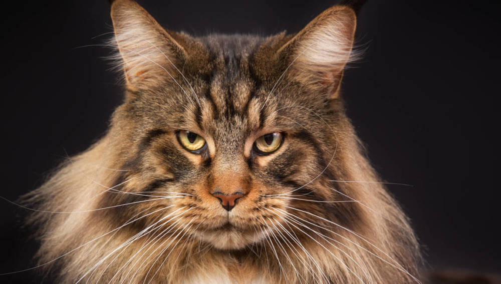

# Koty

https://jolapaslek.github.io/jola/[kotki]

   ** Męskie

    ** Żeńskie

== Najpopularniejsze imiona dla kotków

|===
| kotek	|  – Tuptuś
| kotek	|  – Mruczek
| kotek	|  – Filemon
| kotek	|  – Puszek
| kotek	|  – Bonifacy
| kotek	|  – Kłębuszek
| kotek	|  – Feliks
| kotek	|  – Luna
| kotek	|  – Kitek
|===

